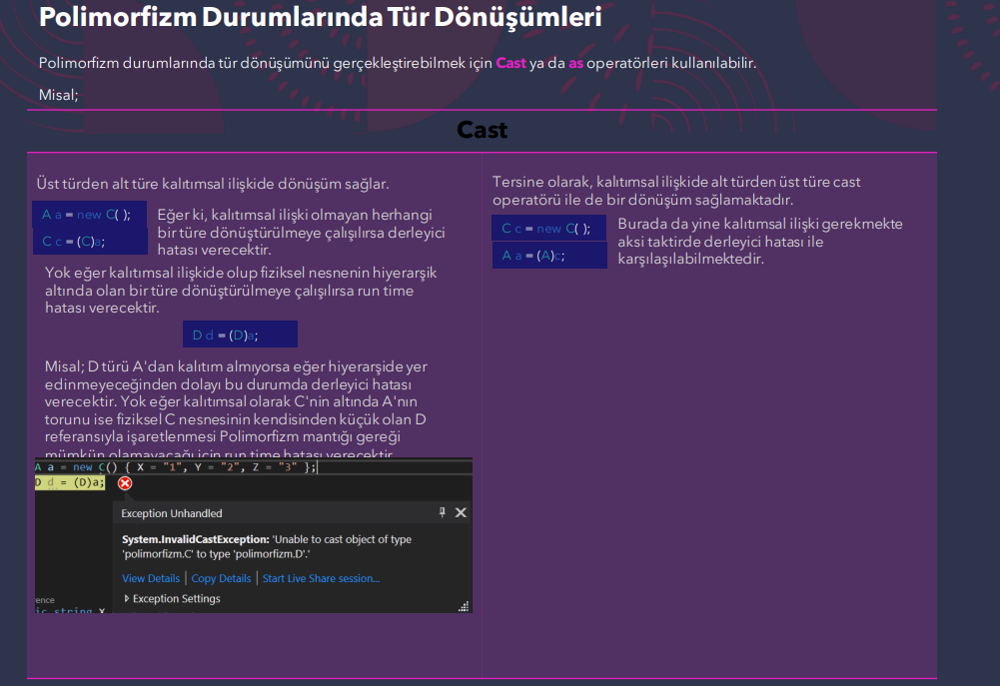

# Polimorfizm (Çok Biçimlilik)

## Polimorfizm (Çok Biçimlilik) Nedir?

Bir nesnenin birden fazla farklı türdeki referans tarafından işaretlenebilmesi polimorfizm'dir. Polimorfizm, OOP tasarımlarında geliştirilen koda daha manevrasal bir şekilde nitelik kazandıran ve yaklaşım sergilememizi sağlayan bir özelliktir. Bir nesnenin, birden fazla referansla işaretlenmesi; o nesnenin, birden fazla türün davranışlarını gösterebilmesini sağlar. Nesne Tabanlı Programlama'da Polimorfizm uygulamak istiyorsanız türler arasında kalıtım uygulanmış olmalıdır.

Programlama da polimorfizm esasında taa en temelden beri kullanılmaktadır. Misal olarak;

- Elimizdeki herhangi bir byte türündeki veriyi ister byte istersekte byte'tan büyük olan herhangi bir türde tutmak çok biçimliliktir.
- Ya da object türünün herhangi bir türdeki değeri alabilmesi yahut bir başka deyişle object türüne herhangi bir türdeki veriyi atayabilmek polimorfizm'dir.

```cs
namespace EducationWorkspace
{

    class A
    {
        public int aProp { get; set; }
        public A()
        {

            Console.WriteLine("A const. çalıştı.");
        }
        public virtual void method1()
        {
            Console.WriteLine("Base Class - method1 çalıştı");
        }
    }
    class B : A
    {
        public int bProp { get; set; }
        public B()
        {
            Console.WriteLine("B const. çalıştı.");
        }
        public override void method1()
        {
            Console.WriteLine("Derived Class - method1 çalıştı");
        }
    }

    class Program
    {
        static void Main(string[] args)
        {
            A o1 = new A();
            o1.aProp = 10;
            Console.WriteLine("----------------------------------");

            A o2 = new B(); // A tipindeki referans = B tipinde bir nesne
                            // B nesnesi üzerinden bir A nesnesi üretilmiştir. Her B bir A iken her A bir B değildir.
                            // "O2" isimli nesne A tipinde bir nesne olduğu için sadece A sınıfının üyelerine erişir.
            o2.aProp = 20;
            Console.WriteLine("----------------------------------");

            B o3 = (B)o2;
            Console.WriteLine(o3.aProp);
            Console.WriteLine(o3.bProp);
            Console.WriteLine("----------------------------------");

            A o4 = new B();
            o4.method1(); // o4 A nesnesi gibi davranıyor ancak burada B sınıfının içindeki method1 çalışıyor. Çünkü B sınıfında metod1 override edilmiştir.
            Console.WriteLine("----------------------------------");

            Console.ReadLine();
        }
    }

}

// Çıktı:
// A const. çalıstı.
// ----------------------------------
// A const. çalıstı.
// B const. çalıstı.
// ----------------------------------
// 20
// 0
// ----------------------------------
// A const. çalıstı.
// B const. çalıstı.
// Derived Class - method1 çalıstı
// ----------------------------------
```

## Polimorfizm Türleri

### Statik Polimorfizm

- Static, ileride göreceğimiz bir kavramdır.
- Şimdilik sadece Polimorfizm çerçevesinde Static Polimorfizm'i
  değerlendireceğiz.
- Static polimorfizm; derleme zamanında sergilenen polimorfizm'dir. Hangi fonksiyonun çağrılacağına derleme zamanında karar verilir.
- C#'da static polimorfizm deyince aklımıza Metot Overloading terimi gelmelidir.
- Metot Overloading; aynı isimde birbirinden farklı imzalara sahip olan metotların tanımlanmasıdır. Ya da başka deyişle bir isme birden fazla farklı türde metot yüklemektir. Haliyle burada bir metodun birden fazla formunun olması polimorfizm'ken, bunlardan kullanılacak olanın derleme zamanında bilinmesi statik polimorfizm olarak nitelendirilmektedir.

### Dinamik Polimorfizm

- Dinamik polimorfizm; çalışma zamanında sergilenen polimorfizm'dir. Yani hangi fonksiyonun çalışacağına run time'da karar verilir.
- C#'da dinamik polimorfizm deyince akla Metot Override gelmektedir.
- Metot Override; base class'ta virtual olarak işaretlenmiş metotların derived class'ta override edilerek ezilmesi/yeniden yazılması işlemidir. Haliyle burada aynı isimde birden fazla forma sahip fonksiyonun olması polimorfizm'ken, bunlardan hangisinin kullanılacağının çalışma zamanında bilinmesi dinamik polimorfizm olarak nitelendirilmektedir.

## Polimorfizm Durumlarında Tür Dönüşümleri

Polimorfizm, OOP'de bir nesnenin kalıtımsal açıdan ataları olan referanslar tarafından işaretlenebilmesidir. Haliyle
ilgili nesne, bu ataları olan referans türlerine göre dönüştürülebilmektedir.




